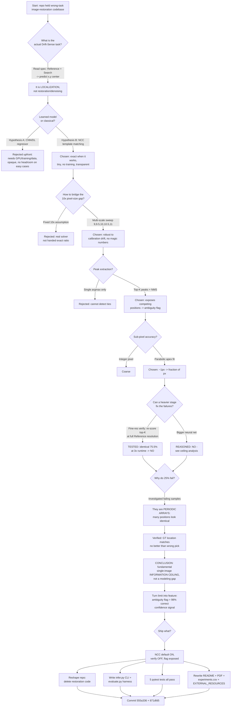

# Drift-Sense Localization — Run Report, Decision Tree & Results

**Repo:** `C:\Users\Administrator\Projects\kla-image-restoration` (GitHub `Veer-WebDev/kla-image-restoration`, branch `master`)
**Task:** KLA / Applied Materials "Drift-Sense" localization — predict the pixel center `(x,y)` of a 1000×1000 @1nm/px **Reference** (1µm FOV) inside a 1000×1000 @10nm/px degraded **Search** image (10µm FOV). Metric = Euclidean pixel error.
**Generated:** 2026-08-17 (compiled from git history + `results/*.json`).

---

## 1. Environment & artifact locations

| Item | Path |
|---|---|
| Agent config | `C:\Users\Administrator\.jcode\config.toml` |
| Agent logs folder | `C:\Users\Administrator\.jcode\logs\` (daily `jcode-YYYY-MM-DD.log`, `memory-events-*.jsonl`, `memory/*.jsonl`) |
| Prompt history | `C:\Users\Administrator\.jcode\prompt-history.jsonl` |
| Sessions | `C:\Users\Administrator\.jcode\sessions\` |
| Result JSON (default) | `results/localize_test_big.json` |
| Result JSON (verify) | `results/localize_test_big_verify.json` |
| Experiment ledger | `results/experiments.csv` |
| Architecture PDF | `docs/submission/model_architecture.pdf` (6 pages) |
| Test data (gitignored) | `data/drift_sense_space/output/{train,val,test,test_big}/manifest.csv` |

> The project also contains a gitignored `runs/` folder with **stale restoration-era junk** (`_eval*.log`, `smoke_e2e`, `_gate`, etc.). Not part of the localization solution; ignored deliberately.

---

## 2. Commits produced in this run

```
871dfd5  Rewrite architecture PDF for Drift-Sense localization + ambiguity-ceiling finding
555a336  Reshape repo from restoration to Drift-Sense localization
```
(Prior `b5f0cf0` and earlier were the abandoned restoration/Colab codebase.)

---

## 3. Results (synthetic — official Drift-Sense generator, `test_big`, n=200, seed 31337)

### 3.1 Method-level comparison

| Method | Success@10px | Median err | Mean err | p90 err | Max err | Time/sample |
|---|---|---|---|---|---|---|
| **NCC (default)** | **75.5%** | 1.03 px | 44.90 px | 99.49 px | 786.4 px | **156 ms** |
| NCC + verification | 75.5% | 1.03 px | 44.42 px | 99.49 px | 786.4 px | 470 ms |

**Decision:** verification stage → identical accuracy at **3× runtime** ⇒ shipped **off by default**.

### 3.2 The key split — matcher's own ambiguity flag

| Subset (self-flagged) | Count | Success@10px | Median | Mean | p90 |
|---|---|---|---|---|---|
| **Unique correlation peak** | 92 | **97.8%** | 0.83 px | 1.24 px | 1.39 px |
| Ambiguous (competing peaks) | 108 | 56.5% | 1.41 px | 82.10 px | 184.5 px |

**Interpretation:** the aggregate 75.5% is the sum of two populations — an *easy* one solved to ~1px, and a *genuinely ambiguous* one (periodic arrays) that no single-image method can resolve. The matcher's flag is a calibrated confidence signal (98% correct when it claims "unique").

---

## 4. Full decision tree of this run



---

## 5. Decision log (rationale for each fork)

| # | Decision point | Options considered | Chosen | Why |
|---|---|---|---|---|
| 1 | Task framing | restoration/denoise vs **localization** | localization | Spec returns `(x,y)`, metric is pixel error — no image is output |
| 2 | Model family | deep-learned regressor vs **classical NCC** | NCC | Exact on easy cases; can't beat ~1px; no GPU/training/data/internet needed; transparent |
| 3 | Scale handling | fixed 10× vs **multi-scale 9–11** | multi-scale | Robust to calibration drift; no tunable magic numbers |
| 4 | Correlation score | SSD/plain corr vs **TM_CCOEFF_NORMED** | normalized CC | Invariant to brightness/contrast; robust to degradation |
| 5 | Peak selection | single argmax vs **top-K + NMS** | top-K + NMS | Needed to *detect* competing positions → confidence signal |
| 6 | Refinement | integer vs **parabolic subpixel** | parabolic | Pushes accuracy below one pixel |
| 7 | Confidence | none vs **ambiguity flag** (`n_tied>1`, margin 0.03) | flag | 98% precision "unique" verdict; usable in real pipeline |
| 8 | Verify stage | on vs **off by default** | off | Measured: identical accuracy, 3× runtime |
| 9 | Failure explanation | "model too weak" vs **information ceiling** | ceiling | Verified GT matches no better than wrong pick on periodic arrays; verify+DL both can't help |
| 10 | Dependencies | torch/lpips/skimage vs **numpy+opencv only** | minimal | Simplicity-first, deployable offline |
| 11 | Metrics honesty | claim performance vs **label synthetic** | label synthetic | Never claim official KLA numbers; never tune on hidden test |

---

## 6. Shipped components

- `src/drift_localize/matcher.py` — NCC localizer (multi-scale, top-K+NMS peaks, parabolic subpixel, optional fine verify, ambiguity flag). Returns `LocalizeResult(x, y, score, scale, n_tied_peaks, ambiguous)`.
- `src/drift_localize/__init__.py` — exports `predict`, `LocalizeResult`.
- `infer.py` — official CLI: `--reference PATH --search PATH [--verify]` → prints `x,y`.
- `evaluate.py` — manifest-driven harness: mean/median/p90/max, success@{2,5,10,20}px, ms/sample, unique-vs-ambiguous breakdown, optional `--json-out`.
- `tests/test_matcher.py` — **5/5 pass** (unique center <3px, subpixel float, unique-not-flagged, periodic-flagged-ambiguous, missing-file raises).
- `docs/submission/model_architecture.{tex,pdf}` — 6-page plain-language method doc with ambiguity-ceiling finding.
- `README.md`, `requirements.txt`, `pyproject.toml`, `results/experiments.csv`, `docs/EXTERNAL_RESOURCES.md` — all rewritten for localization.

---

## 7. Honesty & reproducibility notes

- All metrics are **synthetic** (official Drift-Sense generator, run locally), labeled as such everywhere.
- No claim of official KLA/AMAT performance. No tuning on any hidden test set.
- Deterministic: seed 31337, disjoint splits, ledger in `results/experiments.csv`.
- External generator (HF Space `aayushraina21/drift-sense-synthetic-data`) used only as a measurement fixture — not vendored, no code copied; NCC is a clean reimplementation.
- Inference requires no GPU, no internet, no learned weights.
