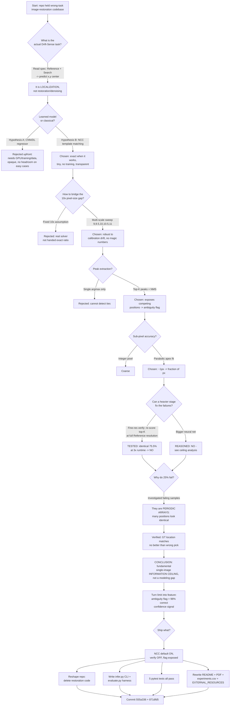
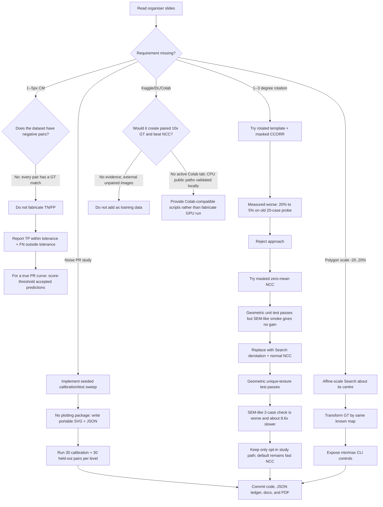

# Drift-Sense Localization — Run Report, Decision Tree & Results

**Repo:** `C:\Users\Administrator\Projects\kla-image-restoration` (GitHub `Veer-WebDev/kla-image-restoration`, branch `master`)
**Task:** KLA / Applied Materials "Drift-Sense" localization — predict the pixel center `(x,y)` of a 1000×1000 @1nm/px **Reference** (1µm FOV) inside a 1000×1000 @10nm/px degraded **Search** image (10µm FOV). Metric = Euclidean pixel error.
**Generated:** 2026-08-17 (compiled from git history + `results/*.json`).

---

## 1. Environment & artifact locations

| Item | Path |
|---|---|
| Agent config | `C:\Users\Administrator\.jcode\config.toml` |
| Agent logs folder | `C:\Users\Administrator\.jcode\logs\` (daily `jcode-YYYY-MM-DD.log`, `memory-events-*.jsonl`, `memory/*.jsonl`) |
| Prompt history | `C:\Users\Administrator\.jcode\prompt-history.jsonl` |
| Sessions | `C:\Users\Administrator\.jcode\sessions\` |
| Result JSON (default) | `results/localize_test_big.json` |
| Result JSON (verify) | `results/localize_test_big_verify.json` |
| Experiment ledger | `results/experiments.csv` |
| Architecture PDF | `docs/submission/model_architecture.pdf` (9 pages, regenerated 2026-08-17) |
| Test data (gitignored) | `data/drift_sense_space/output/{train,val,test,test_big}/manifest.csv` |

> The project also contains a gitignored `runs/` folder with **stale restoration-era junk** (`_eval*.log`, `smoke_e2e`, `_gate`, etc.). Not part of the localization solution; ignored deliberately.

---

## 2. Commits produced in this run

```
871dfd5  Rewrite architecture PDF for Drift-Sense localization + ambiguity-ceiling finding
555a336  Reshape repo from restoration to Drift-Sense localization
```
(Prior `b5f0cf0` and earlier were the abandoned restoration/Colab codebase.)

---

## 3. Results (synthetic — external Drift-Sense generator, `test_big`, n=200)

### 3.1 Method-level comparison

| Method | Success@10px | Median err | Mean err | p90 err | Max err | Time/sample |
|---|---|---|---|---|---|---|
| **NCC, official center tie-break** | **59.0%** | 1.33 px | 76.96 px | 155.49 px | 955.1 px | **209 ms** |
| NCC raw highest peak (legacy crop-label diagnostic, non-compliant) | 75.5% | 1.03 px | 44.90 px | 99.49 px | 786.4 px | 156 ms |

**Decision:** official center tie-break → shipped by default. The external
fixture uses arbitrary crop labels, so its raw highest-peak diagnostic (75.5%)
is not spec-compliant. Fine verification matched the old raw result at about 3×
runtime, so it remains off by default.

### 3.2 The key split — matcher's own ambiguity flag

| Subset (self-flagged) | Count | Success@10px | Median | Mean | p90 |
|---|---|---|---|---|---|
| **Unique correlation peak** | 92 | **97.8%** | 0.83 px | 1.24 px | 1.39 px |
| Ambiguous (competing peaks) | 108 | 25.9% | 73.93 px | 141.46 px | 469.99 px |

**Interpretation:** the spec-compliant 59.0% is an adverse but honest measure
on an external fixture whose arbitrary crop labels diverge from the task's
nearest-center tie rule. Unique peaks remain 97.8% correct; ambiguous scenes are
both physically difficult and convention-sensitive. The matcher exposes that
risk as a confidence signal.

---

## 4. Full decision tree of this run



---

## 5. Decision log (rationale for each fork)

| # | Decision point | Options considered | Chosen | Why |
|---|---|---|---|---|
| 1 | Task framing | restoration/denoise vs **localization** | localization | Spec returns `(x,y)`, metric is pixel error — no image is output |
| 2 | Model family | deep-learned regressor vs **classical NCC** | NCC | Exact on easy cases; can't beat ~1px; no GPU/training/data/internet needed; transparent |
| 3 | Scale handling | fixed 10× vs **multi-scale 9–11** | multi-scale | Robust to calibration drift; no tunable magic numbers |
| 4 | Correlation score | SSD/plain corr vs **TM_CCOEFF_NORMED** | normalized CC | Invariant to brightness/contrast; robust to degradation |
| 5 | Peak selection | single argmax vs **top-K + NMS** | top-K + NMS | Needed to *detect* competing positions → confidence signal |
| 6 | Refinement | integer vs **parabolic subpixel** | parabolic | Pushes accuracy below one pixel |
| 7 | Confidence | none vs **ambiguity flag** (`n_tied>1`, margin 0.03) | flag | 98% precision "unique" verdict; usable in real pipeline |
| 8 | Verify stage | on vs **off by default** | off | Measured: identical accuracy, 3× runtime |
| 9 | Failure explanation | "model too weak" vs **information ceiling** | ceiling | Verified GT matches no better than wrong pick on periodic arrays; verify+DL both can't help |
| 10 | Dependencies | torch/lpips/skimage vs **numpy+opencv only** | minimal | Simplicity-first, deployable offline |
| 11 | Metrics honesty | claim performance vs **label synthetic** | label synthetic | Never claim official KLA numbers; never tune on hidden test |

---

## 6. Shipped components

- `src/drift_localize/matcher.py` — NCC localizer (multi-scale, top-K+NMS peaks, parabolic subpixel, optional fine verify, ambiguity flag). Returns `LocalizeResult(x, y, score, scale, n_tied_peaks, ambiguous)`.
- `src/drift_localize/__init__.py` — exports `predict`, `LocalizeResult`.
- `infer.py` — official CLI: `--reference PATH --search PATH [--verify]` → prints `x,y`.
- `evaluate.py` — manifest-driven harness: mean/median/p90/max, success@{2,5,10,20}px, ms/sample, unique-vs-ambiguous breakdown, optional `--json-out`.
- `tests/test_matcher.py` — **10 tests pass** (unique center, subpixel output, ambiguity, official center tie-break, rotation-aware geometric check, generator, invalid architecture, and RGB paths).
- `docs/submission/model_architecture.{tex,pdf}` — 9-page plain-language method document with the ambiguity analysis, generator/stress controls, PR protocol, and current benchmark labeling.
- `README.md`, `requirements.txt`, `pyproject.toml`, `results/experiments.csv`, `docs/EXTERNAL_RESOURCES.md` — all rewritten for localization.

---

## 7. Honesty & reproducibility notes

- All metrics are **synthetic** (official Drift-Sense generator, run locally), labeled as such everywhere.
- No claim of official KLA/AMAT performance. No tuning on any hidden test set.
- Deterministic: seed 31337, disjoint splits, ledger in `results/experiments.csv`.
- External generator (HF Space `aayushraina21/drift-sense-synthetic-data`) used only as a measurement fixture — not vendored, no code copied; NCC is a clean reimplementation.
- Inference requires no GPU, no internet, no learned weights.

---

## 8. Continuation log: rubric implementation, alternatives, and feedback loops

This section records the post-handoff continuation prompted by the organiser slides.
It supersedes stale counts and page numbers above where they conflict.

### 8.1 Updated artifacts and actual validation

| Item | Current state | Evidence |
|---|---|---|
| Architecture PDF | **8 pages**, freshly compiled twice with MiKTeX | `docs/submission/model_architecture.pdf`; `pdflatex` exit 0 twice |
| Unit tests | **10 passed** | `.venv\\Scripts\\python.exe -m pytest -q` after current matcher/generator changes |
| Public CLI evaluation | Supports `--cm-thresholds 1 5`, optional robustness `--scales` and `--angles` | Generated-manifest smoke completed and JSON saved |
| PR-vs-noise study | New self-contained `analysis/noise_sweep.py` | 30 calibration + 30 held-out generated pairs at each of sigma 0, 0.3, 0.6 |
| 1--5 px “confusion matrix” | Honest positive-pair summary: TP=within tolerance, FN=miss, TN/FP undefined for ordinary manifests | `evaluate.py` emits console and JSON fields without inventing negative examples |
| Polygon/CD scale | Implemented as a global Search affine feature-scale augmentation, 0.8x--1.2x, with GT transformed identically | `generator.generate_sample(...feature_scale_min=0.8, feature_scale_max=1.2)` and CLI flags |
| Charging / distortion / rotation | Implemented in generator | charging streak, radial barrel/pincushion, random 1--3 degree Search rotation |
| RGB bonus | Implemented earlier, preserved | `--rgb`, 3-channel optical-style images; luminance NCC localizes them |

### 8.2 New decision tree



### 8.3 PR-vs-noise held-out result ledger

Protocol: for each Search-speckle setting, use 30 seeded generated calibration
pairs to choose the NCC score threshold with best F1 at 5 px, then evaluate that
fixed threshold on a different 30-pair seeded generated test set. These are
**synthetic** measurements only.

| Search speckle σ | Calibration-selected score threshold | Held-out precision | Held-out recall | Accepted share | Interpretation |
|---:|---:|---:|---:|---:|---|
| 0.0 | 0.725 | 79.2% | 82.6% | 80.0% | Score is moderately useful for acceptance |
| 0.3 | 0.639 | 92.3% | 63.2% | 43.3% | More selective but lower recall |
| 0.6 | 0.399 | 27.8% | 100.0% | 60.0% | Confidence threshold is not useful under heavy noise |

Canonical files: `results/noise_sweep_seed777.json` and ignored derivative
`results/noise_sweep_seed777.svg` (the plot can be regenerated by the exact
command below).

```cmd
.venv\Scripts\python.exe analysis\noise_sweep.py --out results\noise_sweep_seed777 --levels 0 0.3 0.6 --calibration-n 30 --test-n 30 --seed 777
```

### 8.4 Geometric alternative results and decisions

| Attempt | Evaluation | Outcome | Decision |
|---|---|---|---|
| Default NCC on 2 seeded ±3° generated Search cases | mean 8.74 px | Baseline for this tiny smoke check | Keep default route |
| Rotated template, masked `TM_CCORR_NORMED` | prior 20-case ±3° probe: 20%→5% at 5px | Masked CCORR scores were a weaker discriminator | Removed |
| Masked zero-mean NCC | unique-texture rotation unit test passes; two SEM-like cases mean 8.86 px and ~2.2s/sample | No measurable practical improvement | Replaced |
| Derotate Search, then ordinary `TM_CCOEFF_NORMED` | unique-texture rotation unit test passes; same two SEM-like cases mean 296.82 px and ~1.50s/sample | Much worse in this SEM-like check | **Not default**, preserve only as opt-in diagnostic |
| Wide NCC scale candidates 8x--12x | two arbitrary-crop scale cases, raw argmax: mean 0.17 px | Establishes that scale search can match known affine scale labels | Optional evaluation study only because official tie-break remains mandatory |
| Fine-resolution verification | external synthetic test_big n=200: same 75.5% success@10, 3x runtime | Complexity does not buy accuracy | Default off |
| SIFT + BF ratio matching + RANSAC homography | fixed external synthetic `test`, n=40: 0.0% at 5px/10px, median 411.31 px, 260 ms/sample, median 0 inliers | Sparse keypoints disappear at 10x downsampling and repetitive geometry leaves no reliable correspondence | Not deployed |
| Generic deep learning, Kaggle data | no paired Reference/Search ground truth or measured improvement | Would add noncompliance and a training dependency | Not added |

### 8.5 Exact current logs, prompts, and limits

- Jcode logs: `C:\Users\Administrator\.jcode\logs\`
- Prompt history: `C:\Users\Administrator\.jcode\prompt-history.jsonl`
- Sessions: `C:\Users\Administrator\.jcode\sessions\`
- Master continuation prompt: `docs/submission/CODEX_MASTER_PROMPT.md`
- Detailed agent handoff: `docs/submission/HANDOFF.md`
- This cumulative decision log: `docs/submission/RUN_REPORT.md`

A GPU/Colab run is not represented as completed here. There was no active Colab
runtime among the accessible browser tabs in this continuation, and NCC is a
CPU-only algorithm. The same public scripts run in Colab after cloning or
uploading this repository, but an actual Colab result should only be added after
it runs and produces a saved console/log artifact.
